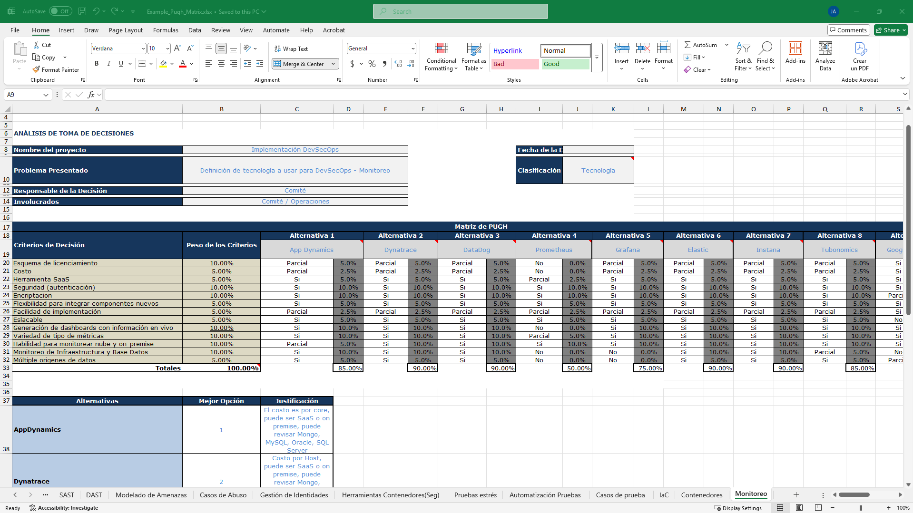
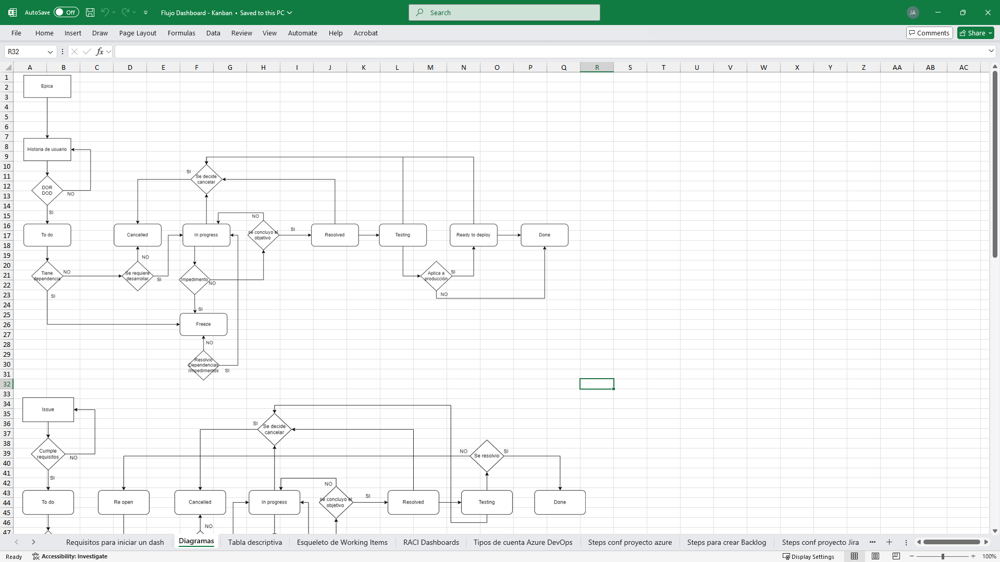
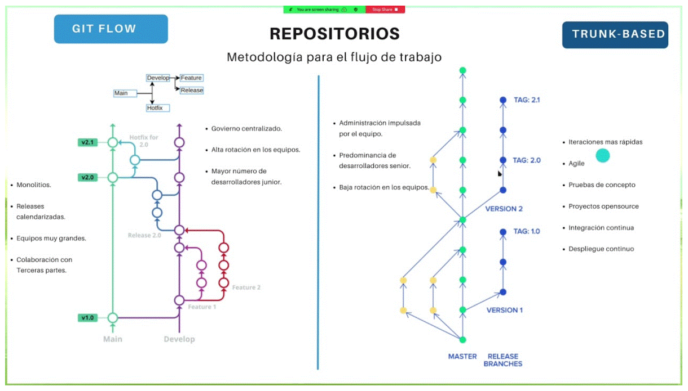
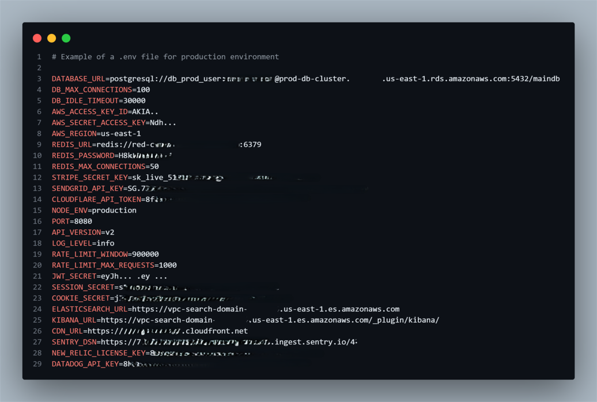
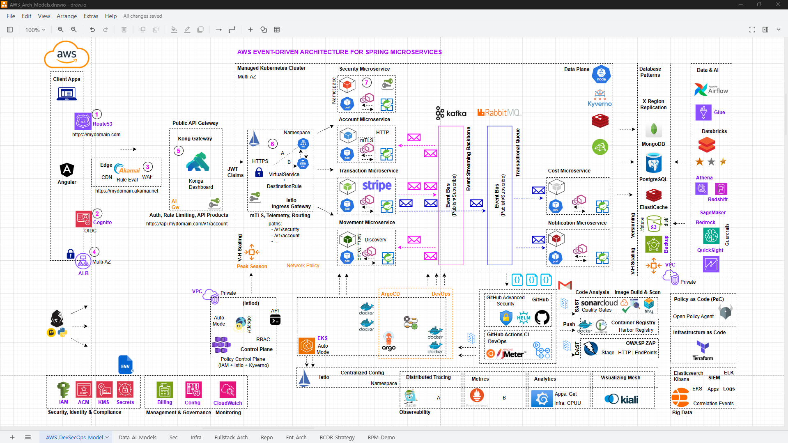

# DevSecOps Model DRAFT

`Business Process Management (BPM)`

`Pugh Matrix`

`Kanban Dashboard Flow`

`Branching Strategy`

-> [Branching Strategy](branching_est.md)

`Environment Files Config`

-> [Environment File Explanation](env_explanation.md)

# GCP, Azure and AWS Architectures

----

# Essential Apps Checklist for your Windows Setup

## Hands-on from Scratch - Install and Use

- Terminal + Powershell
- Warp Terminal
- Chocolatey
- Pip
- WSL Ubuntu + apt
- SDKMAN
- Sys / Path Variables
- Browsers
- Productivity
- Collab
- Architecture
- IDEs
- DataBase
- Docker
- Kubernetes
- So on ..

-> [CLI-GUI](cli-gui.md)

# VSCode Extensions 4 Devs

## Categories:

- Syntax
- Git
- Docu
- JavaScript
- Golang
- Java
- Python
- Infra / CICD
- Security
- Optional

-> [VSC-EXTENSIONS](vsc-ext.md)

# Infra Commands

## Includes:

- Git
- Docker
- Docker Compose
- Kubernetes
- Helm
- Terraform
- Vagrant

-> [INFRA-COMMANDS](infra-cmds.md)