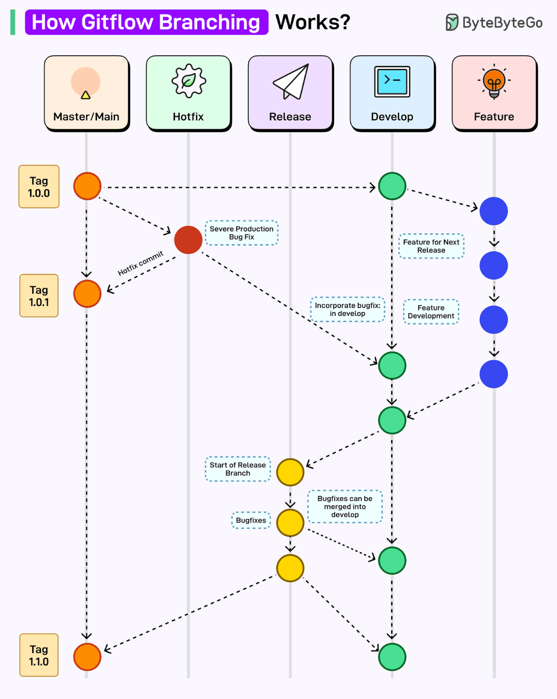
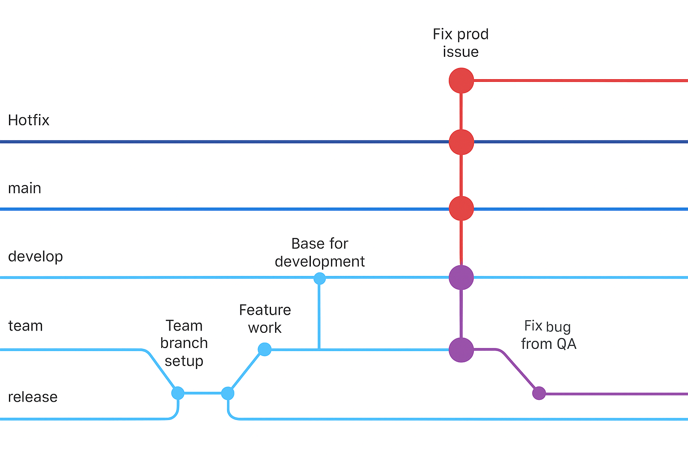
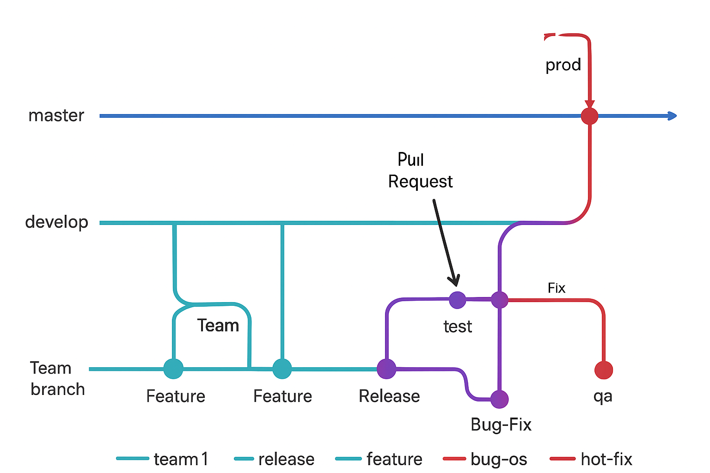

# Branching Strategy

## How `GitFlow` Branching Works

## `GitFlow` for a single DevTeam

## `GitFlow` for more than one DevTeam in parallel

## Development Branches

### `Description`

- It is a branch that is born from the main branch (main/master)
- It is the branch from which the Development environment will be obtained
- It is the branch from which the “Features” will be born to develop each HU
- It is the integration branch for all changes
- It is the branch from which the direct changes for the Release will be obtained

### `Workflow`

- The branch is generated from the branch (main/master)
- Child branches called Features are created
- Feature changes are integrated
- A Release branch is generated from the latest version of Develop
- Any changes made to the Release branch must be integrated into Develop
- Any Hot-fix that is made in the Master branches must be integrated into Develop

### `Ways to modify the branch`

- Through Pull Request of a Feature, Release or Hot-Fix to Develop

### `Roles that can make changes`

- Developer: Generate Features, generate the Pull Request
- Infrastructure Engineer: Generate Features, generate Pull Request
- Technical leader: Approve Pull Requests
- Infrastructure Leader: Approve Pull Requests
- Automated tester: Generate Features, generate Pull Request.

## Team Branches

### `Description`

- It is a branch that is born from the Develop branch
- It is the branch from which the “Features” will be born to develop each HU
- It is the integration branch for all changes

### `Workflow`

- This branch will only exist in case another cell has to be added that impacts the same component.
- The branch is generated from the branch (Develop)
- Child branches called Features are created
- Features changes are integrated
- Any changes made to the Release branch must be integrated into the Team branch
- Any Hotfix that is made in the Master branches must be integrated into the Team branch

### `Ways to modify the branch`

- Through Pull Request of a Feature

### `Roles that can make changes`

- Developer: Generate Features, generate the Pull Request
- Infrastructure Engineer: Generate Features, generate Pull Request
- Technical leader: Approve Pull Requests
- Infrastructure Leader: Approve Pull Requests
- Automated tester: Generate Features, generate Pull Request.

## Feature Branches

### `Description`

- It is a “child” branch that is created from the latest version of Develop, the “Pull” action must be executed to obtain the latest changes
- Files will be modified to satisfy work activities
- The naming convention for each branch will be:
  - feature-IdTask-SpecificActivity
  - feature-23-AddCatalog
- Once the changes are completed, the Feature is destroyed
- There should not be more Features than developers or tasks running.

### `Workflow`

- The branch is generated from the latest version of Develop
- It is modified in the branch
- Pull Request of the Feature is generated towards Develop
- Feature is destroyed

### `Ways to modify the branch`

- The branch owner has to commit the changes that need to be versioned
- The title of the commit will be the idTarea-ActividadDelCommit
  - 23-AddTable
- The commit description must be a brief description of the changes that will be saved
- The branch owner has to push the changes from their local environment to the remote repository

### `Roles that can make changes`

- Desarrollador: Generar Features, generar el Pull Request
- Ing. Infraestructura: Generar Features, generar el Pull Request
- Tester automatizador: Generar Features, generar Pull Request.

## Release Branches

### `Description`

- It is a branch that is born from the Develop branch
- It is the branch from which the Quality environment will be obtained
- To resolve errors, a Bug-Fix must be generated from Release

### `Workflow`

- The branch is generated from the Develop branch
- Once created, a merge is made from Develop to Release
- In case of a bug, a Bug-Fix branch must be created from Release
- When the changes within Release are approved, a Tag must be generated whose name convention will be:
  - Vx.x.x
- When the tag is generated, the changes will be pushed to the Master branch and if there were changes they must be pushed to Develop

### `Ways to modify the branch`

- It is created from Develop
- Once the branch is created, a merge must be made from Develop to Release
- Bug-Fix branches are created
- Bug-Fix changes are integrated into Release

### `Roles that can make changes`

- Developer: Generate Bug-Fix, generate Pull Request
- Infrastructure Engineer: Generate Bug-Fix, generate Pull Request
- Tech Lead: Create branch, merge from Develop to Release, accept Pull Request
- Infrastructure Leader: Approve Pull Requests

## Bug-Fix Branches

### `Description`

- It is a branch that is born from the Release branch
- In this branch the errors that will emerge from the tests will be corrected
- The naming convention for a Bug-Fix will be:
  - bugfix-IncidentId
- Once the Bug-Fix is ​​completed, it must be destroyed.
- There should not be more Bug-Fix branches than developers or running bugs.

### `Workflow`

- The branch is generated from the latest Release version
- It is modified in the branch with the necessary changes
- The commit is generated and pushed
- Pull Request is generated from the Bug-Fix to Release
- Bug-Fix is ​​destroyed

### `Ways to modify the branch`

- The branch owner has to commit the changes that need to be versioned
- The title of the commit will be the idTarea-ActividadDelCommit
  - 23-AddTable
- The commit must be a brief description of the changes that will be saved
- The branch owner has to push the changes from their local environment to the remote repository

### `Roles that can make changes`

- Developer: Generate Bug-Fix, generate Pull Request
- Infrastructure Engineer: Generate Bug-Fix, generate Pull Request
- Technical leader: Approve Pull Requests
- Infrastructure Leader: Approve Pull Requests

## Master/Main Branch

### `Description`

- It is the main branch where only changes that are approved from the Release branch will arrive.
- It is the branch where the productive environment will emerge
- In case of any error, a Hot-Fix must be generated
- Any change that comes from a Hot-Fix must generate a new tag

### `Workflow`

- It is the main branch, it is the first one that is born in the projects
- Develop branch is generated
- When a Release is ready, the changes are integrated into Master to be deployed
- In case of any error, a Hot-Fix must be generated to correct it.

### `Ways to modify the branch`

- A Merge is made from Release to Master
- Pull Request for a Hot-Fix is ​​approved

### `Roles that can make changes`

- Developer: Generate Hot-Fix, generate Pull Request
- Infrastructure Engineer: Generate Hot-Fix, generate the Pull Request
- Technical Lead: Generate the merge from Release to Master, approve Pull Request
- Infrastructure Leader: Approve Pull Requests

## Hot-Fix Branches

### `Description`

- It is a branch that is born from the Master branch
- In this branch the errors that will arise from productive incidents will be corrected
- The naming convention for a Hot-Fix will be:
  - hotfix-IncidentId
- Once the Hot-Fix is ​​completed, it must be destroyed.
- There should not be more Hot-Fix branches than developers or bugs running.

### `Workflow`

- The branch is generated from the latest version of Master
- It is modified in the branch with the necessary changes
- The commit is generated and pushed
- When the HotFix is ​​finished, it must be deployed in the Test environment, or in a specific environment to be able to test
- Pull Request is generated from the Hot-Fix to Master
- The Hot-Fix is ​​destroyed

### `Ways to modify the branch`

- The branch owner has to commit the changes that need to be versioned
- The title of the commit will be the idTarea-ActividadDelCommit
  - 23-AddTable
- The commit must be a brief description of the changes that will be saved
- The branch owner has to push the changes from their local environment to the remote repository

### `Roles that can make changes`

- Developer: Generate Hot-Fix, generate Pull Request
- Infrastructure Engineer: Generate Hot-Fix, generate the Pull Request
- Technical leader: Approve Pull Requests
- Infrastructure Leader: Approve Pull Requests

----

# GitFlow Rollback

`Use in case of emergencies` -> [GitFlow Rollback](gitflow_rollback.md)

[Home](README.md) <-